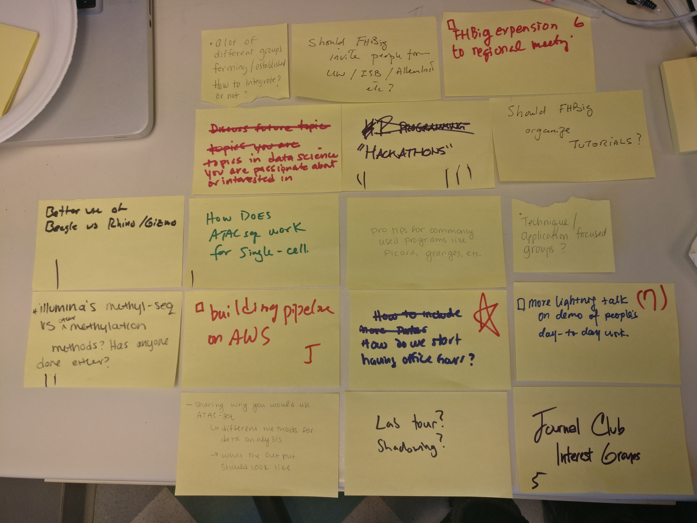

<figure>
  
  <figcaption>Sticky notes collected from the lean coffee meeting on 10/4/2018.</figcaption>
</figure>

On October 4th, 2018, FHBig hosted a lean coffee meeting 
gathering thoughts from our members about FHBig's future 
activities and direction.  Below is the summary:

- Better use of Beagle on Rhino/Gizmo  

  
<strong>Follow-up:</strong> SciWiki has a page about beagle usage: <a href="https://sciwiki.fredhutch.org/infdemos/how_to_beagle/">How to Beagle</a>.
  

 

- Illumina's methyl-seq and other methylation methods?   

  
<strong>Action:</strong> Should we create a co-working poll asking people around?
  

 

- A lot of different groups forming/extablised. How to integerate or not?

  
<strong>Follow-up:</strong> COOP to the resecue.
  

 

- Topics in data science you are passinate about or interested in
- Building pipleline on AWS  
- Should FHBig invite peple from UW/ISB/Allen, etc?  
- HACKATHONS  
- Should FHBig organize tutorials?
- Protips for commonly used programs like _picard_, _granges_, and etc
- More lightning talk on demo of people's day-to-day work
- Technical application focused groups?
- How do we start having office hours?
- Journal club and its co-ordinators?
- How do we start having office hours?

## Follow-up
- find experts of _picard_ and _bioconductor_?
- create co-working-polls to find peple interested in methyl-seq and methods?
- have pop-up workshops for day-to-day works such as Bioconductor 101 and other topics?
- What tutorial we need? Post request on co-working poll channel?
