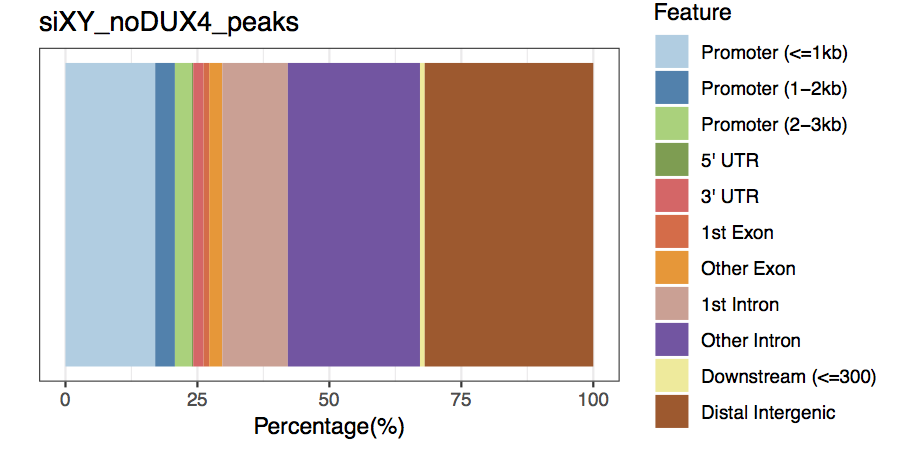

```{r setup, include=FALSE}
knitr::opts_chunk$set(echo = FALSE)
```

## Overview

[Buenrostro 2015](https://www.ncbi.nlm.nih.gov/pmc/articles/PMC4374986/pdf/nihms653929.pdf):

_Assay for Transposase Accessible Chromatin with 
high-throughput sequencing (ATAC-seq) is a method 
for mapping chromatin accessibility genome-wide._ 


## Data analysis

__Data Pre-processing__: make clean BAM files   

- Adpator removel    
- Alignments    
- PCR duplicates    
- Exclude chrM    
- Sanity check    

__Downstream analysis__    

- Peaking calling  
- Annotation  
- Differential binding  

## Data analysis

__Software requirement__  

- cutadapt
- picard
- samtools
- bowtie2
- FASTQC
- MACS2

__BioConductor__

- ChIPseeker or ChIPpeakAnno
- DiffBind  


## Pre Pre-Processing
__Quality Control__  

    FASTQC

__Chasity filtering__   

    Casava 1.8 format -> retain reads with filter flag=N
    @EAS139:136:FC706VJ:2:2104:15343:197393 1:N:18:ATCACG

```sh
for i in *fastq.gz
do
    i2=${i//.gz/}
    zgrep -A 3 '^@.*[^:]*:N:[^:]*:' $i \ 
    | zgrep -v '^\-\-$' > $fileredDir/$i2
done
```

    Tips: Hutbase.org offers FASTQC+Filtering pipeline

##Pre Pre-Processing
__Concatenate sequence reads on multiple lanes __  

Genomic Core sequence samples on multiple lanes may have separate files for each lane. 

```sh
cat $(ls *_R1_*.fastq.gz) > sampleName_R1.fastq.gz
```
or 
```sh
zcat $(ls *_R1_*.fastq.gz) > sampleName_R1.fastq
```

## Apater removal

[cutadapt](https://cutadapt.readthedocs.io/en/stable/guide.html) searches input reads for a given adapter sequence and removes it.   

__Usual parameters__

- `-a` to remove 3' adapter
- `-g` to remove 5' adapter
- `-0` to give minimal length of the provided adapter sequence.

## Adapter removal
__Illumina Nextera Transposase Adapters__   

```
Read 1
5’ TCGTCGGCAGCGTCAGATGTGTATAAGAGACAG  
Read 2  
5’ GTCTCGTGGGCTCGGAGATGTGTATAAGAGACAG  
```


```sh
ml cutadapt
cutadapt -g TCGTCGGCAGCGTCAGATGTGTATAAGAGACAG \
    -O 5 -e 0.2 \
    input_R1.fastq > output_R1.fastq 2> report_R1.txt
gzip output.fastq
```

## Alignment using Bowtie2
__Genomic indexes__  

Pre-build reference are available from iGenome

```sh
cd /shared/biodata/ngs/Reference/iGenomes
cwon2@rhino2:/shared/biodata/ngs/Reference/iGenomes$ ls -lt
total 682
drwxrwsr-x 3 rbasom   biodata_adm   22 Dec  6  2017 Bos_taurus
drwxrwsr-x 7 mfitzgib biodata_adm  155 Jul 27  2017 Homo_sapiens
drwxrwsr-x 4 rbasom   biodata_adm   47 Aug 22  2016 Rattus_norvegicus
drwxrwsr-x 3 rbasom   biodata_adm   25 Jun  8  2016 Macaca_mulatta
drwxrwsr-x 4 rbasom   biodata_adm   47 Jan 26  2016 Caenorhabditis_elegans
drwxrwsr-x 4 rbasom   biodata_adm   47 Jan 14  2016 Saccharomyces_cerevisiae
drwxrwsr-x 3 rbasom   biodata_adm   22 Nov  4  2015 Danio_rerio
drwxrwsr-x 3 rbasom   biodata_adm   22 Sep  1  2015 Gallus_gallus
drwxrwsr-x 4 rbasom   biodata_adm   47 May 18  2015 Canis_familiaris
drwxrwsr-x 4 mfitzgib biodata_adm   44 Oct 30  2014 Drosophila_melanogaster
```

```/Homo_sapiens/UCSC/hg38/Sequence/Bowtie2Index/genome
```

## Alignment using Bowtie2
__Usual paramters__  

|parameter | description | default |  
| ---------|:-----------|:-------|
| `-X <int>` |	Maximum DNA fragment length |500|
|`--very-sensitive`| better alignment results are frequently achieved with it | --sensitive|
|`-p <int>`|Number of cores on which to run|1|
|`--seed <int>`| number used to initialize a pseudorandom number generator| |
|`-k <int>`| Search for one or more alignments, report <int> aligments| |
|`-a`| Search for and report all alignments | |


## Alignment using Bowtie2
```sh
ml bowtie2/2.2.5   # if not already loaded
ml samtools/1.0
bowtie2 --very-sensitive -p 4 \
     -I 20 -X 1000  -x $hg38_genomeBuild \
     -1 $trim1.gz -2 $trim2.gz \
    | samtools view -Sb - > $sampleName.bam
```


## Alignment using Bowtie2

__Why setting `-X 1000` is reasonable?__

- necleosome (~147bps) + space in between (~20bps) ~= 160 bps
- cover up at least three size of nucleosomes ~= 600 bps
- cover up possible sikpped nucleosoms at TSS
- just to loosen up


## Sort BAM

```sh
# sort 
samtools sort -@ 4 $sampleName.bam $sampleName.bam.sorted
mv $sampleName.bam.sorted.bam $sampleName.bam
```


## Exclude chrM

ATAC-seq datasets usually contain decent among of reads derived from chrM. 

```sh
samtools view -h $sampleName.bam | awk '{if($3 != "chrM"){print $0}}' \ 
    | samtools view -Sb - > $sampleName\_rmChrm.bam
    
mv $sampleName\_rmChrm.bam $sampleName.bam    
```

    Very slow. Better way: write a python package or use picard(?) to remove chrM.

## PCR duplicates
PCR duplicates are exact copy of fragments and are artifacts of the library preparation.

```sh
ml picard/2.7.1-Java-1.8.0_92
java -jar ${EBROOTPICARD}/build/libs/picard.jar MarkDuplicates  \
     I=$sampleName.bam O=$sampleName\_filter.bam  \
     M=$sampleName\_dup\_matrics.txt REMOVE_DUPLICATES=true \
     ASSUME_SORTED=true \
     TMP_DIR=$HOME/tmp


mv $sampleName\_filer.bam $sampleName.bam

```

    Tips: use sorted BAM and TMP_DIR to save space and time

## Index BAM
Finish up!

```sh
samtools index $sampleName.bam
touch $sampleName.bowtie2Done.txt
```

## Peak Calling using MACS2

Example of using proper paired reads and real insert size:

```sh
ml MACS2/2.1.1.20160309-foss-2015b-Python-2.7.9
macs2 callpeak -f BAMPE -t $sampleName.bam \
      -g hs \
      --outdir <output_dir> -n <file_prefix>  -q 0.05 \
      --keep-dup all
```

## Peak Calling using MACS2
### Hints  
- If PCR duplicates are not removed already, use default setting `--keep-dup 1` to keep one tag of at the sample position.  
- If looking for enriched cutting sites. Assuming 200 is the average fragment size:

```sh
--nomodel --shift -100 --extsize 200
```
    
## Annotation

Biocondutor __ChIPseeker__ or __ChIPpeakAnno__ packages


```{r load lib, echo=TRUE, eval=FALSE}
library(ChIPseeker)
library(plyranges)
library(ggplot2)
library(org.Hs.eg.db)
library(TxDb.Hsapiens.UCSC.hg38.knownGene)
```

## Annotaion
Bridge MACS2's narrowPeaks bed file to ChIPseeker
```{r annotation, echo=TRUE, eval=FALSE}
#' peaks bed file -> GRanges
readNarrowPeaksBed <- function(bed_file) {
    peaks <- read.table(bed_file, sep="\t", stringsAsFactors=FALSE)
    colnames(peaks) <- c("seqnames", "start", "end",
                         "name", "int10Log10qvalue", ".",
                         "fold_enrichement", "nLog10pvalue",
                         "nLog10qvalue", "summit")
    plyranges::as_granges(peaks)
}
```

## Annotation
Example using __ChIPseeker::annotatePeak()__ and __ChIPseeker::plotAnnoBar()__.

```{r annotation1, echo=TRUE, eval=FALSE}
x <- "sampleName_peak.narrowPeaks"
peaks <- readNarrowPeaksBed(x)
peaks_annotation <-
    ChIPseeker::annotatePeak(peaks,
                            TxDb = TxDb.Hsapiens.UCSC.hg38.knownGene,
                            annoDb = "org.Hs.eg.db")
gg <- ChIPseeker::plotAnnoBar(peaks_annotation)
ggsave(filename=filename, gg, device="pdf", width=6, height=3)
```

## Annotation
Example using __ChIPseeker::annotatePeak()__ and __ChIPseeker::plotAnnoBar()__


